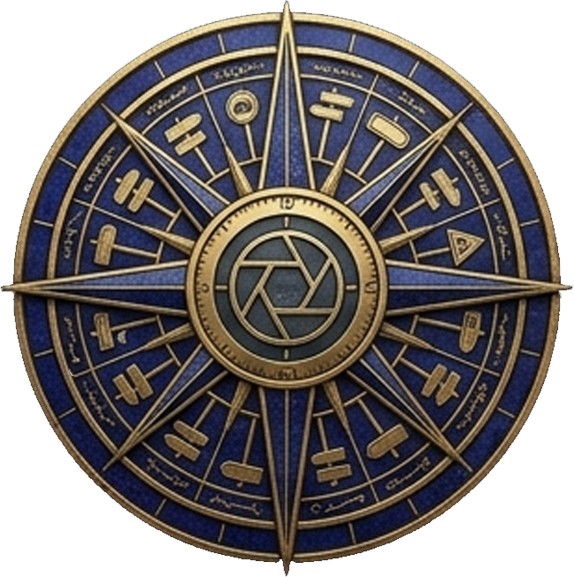

# Mithra · میترا

**AI-powered panoramic vision platform for intelligent asset detection and street inventory.**

<p align="center">
  
</p>

Mithra takes imagery — street panoramas, satellite scenes, aerial tiles, a GeoTIFF you
own — and returns a counted, mapped, auditable inventory of what is in it. Seventy-one
kinds of thing across ten domains: water and land cover, buildings and land use, roads
and pavement condition, street furniture, energy infrastructure, crops, vehicles, and
signs.

Pick an area, pick an imagery source, pick what to look for. Before anything runs, the
console tells you which model would answer it, on what evidence, and refuses the
pairings that cannot produce an honest answer — a tree is not findable at ten metres
per pixel, a manhole is invisible from orbit, and there is nothing to detect in a
drawn map.

Built for the people who have to answer *how many, of what kind, and where* — and who
will be asked to prove it.

| Domain | What it covers | From |
|---|---|---|
| Water | Lakes, rivers, reservoirs, flood extent | Satellite |
| Land cover | Forest, cropland, built-up, bare ground, snow | Satellite |
| Land use | Residential, commercial, industrial, quarries, parks | Satellite, aerial |
| Buildings | Type, roof material, construction state | Aerial, street |
| Transport | Roads, surface, crossings, bridges, rail, runways | Aerial, street |
| Condition | Pavement distress, potholes, marking wear, façades | Aerial, street |
| Street furniture | Signs, lights, poles, hydrants, bins, bus stops | Street |
| Energy | Solar panels, turbines, power lines, substations | Aerial |
| Agriculture | Field boundaries, orchards, irrigation pivots | Satellite, aerial |
| Vehicles | Cars, trucks, buses, ships, aircraft | Aerial |

Each target names the coarsest imagery it can be found in, so the console can refuse a
pairing before it costs an hour rather than after.

---

## What it does

- **Surveys a street, not a rectangle.** You name a street; Mithra resolves its
  geometry from OpenStreetMap, buffers a corridor around the centreline, and surveys
  that. A count for "Ahmadabad Boulevard" means the boulevard, not a box that happens
  to contain it.
- **Detects and classifies.** Signs are found in panoramic imagery and sorted into the
  taxonomy above. Anything the model is unsure about becomes `unknown` and goes to a
  person rather than into the count as a guess.
- **Shows its evidence.** Every sign carries its crop, its source image, its
  coordinates, its confidence, and the model version that produced it. A number you
  cannot trace back to a photograph is not an inventory.
- **Improves from the work.** The review queue collects labels; those labels train a
  classifier that must prove it beats the model in service before it can replace it.
- **Takes your own map.** Any XYZ tile service can be added as a basemap, so the
  inventory is read against the map the organisation already trusts.
- **Answers at inventory scale.** Filtering, searching, sorting and paging happen in
  the database, so the count in the corner is the real count rather than the count of
  the first two thousand rows. A filtered view is a URL you can send to somebody.
- **Records who did what.** Sign-ins, runs, deletions, account changes and label
  overrides are written to an append-only audit log as they happen — a relabelled
  detection keeps the class the model chose and how confident it was, which exists
  nowhere else once the row is overwritten.

## Screens

| Section | Question it answers |
|---|---|
| Dashboard | How big is the inventory, how much is trustworthy, what is waiting |
| Detect | Find features in satellite, aerial or uploaded imagery |
| Surveys | What has been surveyed, and run another |
| Inventory | Every detection across every run — filter, sort, map, export |
| Review | Judge what the model was unsure about |
| Audit | Who changed what, and when (administrators) |
| Settings | What this server can run, system state, basemaps, accounts |

Persian and English, right-to-left and left-to-right, dark and light. `⌘K`
anywhere; `/` focuses search; arrow keys walk a list.

---

## Quick start

You need Docker and a [Mapillary access token](https://www.mapillary.com/dashboard/developers).

```bash
git clone https://github.com/itsmadson/Mithra.git
cd Mithra
cp .env.example .env        # then put your Mapillary token in it

docker compose up -d        # database, queue, migrations, API, worker, console
```

Open <http://localhost:3000>. That is the whole thing running — there is nothing
to start by hand, and `docker compose down` stops all of it without touching the
data.

If port 3000 is taken on your machine, set `WEB_PORT` in `.env` and rebuild the
web image (`docker compose build web`), since the console's API address is baked
in at build time. The first account you create becomes the administrator
of a new organisation; there is no default password to change.

### Images

Published to the GitHub Container Registry from CI:

```
ghcr.io/itsmadson/mithra/api:latest   # API, worker, and migrations
ghcr.io/itsmadson/mithra/web:latest   # the console
```

The API and worker share one image because they import the same code; the command
decides which one a container becomes.

---

## Running from source

```bash
docker compose up -d db redis           # just the backing services
python -m venv .venv && .venv/bin/pip install -e "services/api[dev,ml]"
(cd services/api && ../../.venv/bin/alembic upgrade head)
(cd apps/web && npm install)

cp .env.example .env                    # set MAPILLARY_TOKEN
./scripts/dev.sh                        # API :8020, console :3100, worker
```

### Verifying coverage first

The pipeline can only find signs where the imagery provider has been. Before
expecting results in a new city:

```bash
export MAPILLARY_TOKEN='MLY|...'
make coverage-probe
```

It reports how many images and sign features exist in one central tile and ends with
a verdict. No coverage means no signs will be found there — which is a fact about the
imagery, not about the street.

### Tests

```bash
make test          # backend and ML
make web-test      # frontend units
make e2e           # browser, against a real stack
```

---

## Architecture

```
browser ── Next.js console ── FastAPI ── PostgreSQL + PostGIS
                                 │
                              Redis ── RQ worker ── Nominatim / Overpass  (street → corridor)
                                                 ── Mapillary            (imagery + detections)
                                                 ── CLIP / linear probe  (classification)
```

| Path | What lives there |
|---|---|
| `apps/web` | Next.js console: dashboard, maps, review queue, settings |
| `services/api` | FastAPI: auth, surveys, signs, labels, exports, stats |
| `services/worker` | The pipeline: corridor, tiling, imagery, cropping |
| `packages/ml` | Classification: CLIP zero-shot, the trained probe, the shared encoder |
| `tests` | Backend, ML, and browser tests |

Deeper detail in [`docs/`](docs/): [architecture](docs/architecture.md),
[pipeline](docs/pipeline.md), [model](docs/model.md),
[deployment](docs/deployment.md), [security](docs/security.md).

---

## Honest limitations

- **Five of seventeen detectors are built.** Water (NDWI), land cover (NDVI/NDBI),
  tree crowns (DeepForest), sign classification (CLIP) and SAM 3 ship in this
  release. The other twelve are declared with their hardware and their published
  accuracy so the console can plan around them — each is one adapter away, not a
  redesign. Seventy-one targets are catalogued; the console says, per target, which
  imagery source and which model would answer it and how well.
  See [docs/model.md](docs/model.md).
- **A drawn map is not imagery.** Pointing a detector at OpenStreetMap tiles finds
  almost nothing — not because the model is weak but because a rendered basemap
  contains symbols, not objects. Tile services must be declared as photographs or
  as cartography, and detection over cartography is refused rather than returning
  a confident zero.
- **SAM 3 has not been run on a GPU by its author.** The adapter is complete and the
  hardware check refuses it where it cannot run, so a laptop gets a clear message
  rather than a crash. Run `python scripts/check_sam.py` on the GPU host before
  trusting a count from it.
- **The street-sign classifier is untrained.** CLIP zero-shot is frequently wrong on
  regulatory signs — it will confidently call a pedestrian crossing a guide sign. The
  review queue exists to fix exactly this.
- **Coverage is the imagery provider's coverage.** No imagery on a street means no
  signs found there, which is not the same as no signs being there. Surveys say so
  rather than reporting zero.
- **Everyone in an organisation sees all of its surveys.** Tenancy separates
  organisations; there is no per-user or per-project restriction inside one.
- **Positions are as accurate as the imagery provider's.** Good enough to find a sign
  on a street, not good enough for cadastre.

---

## Licence

MIT.
